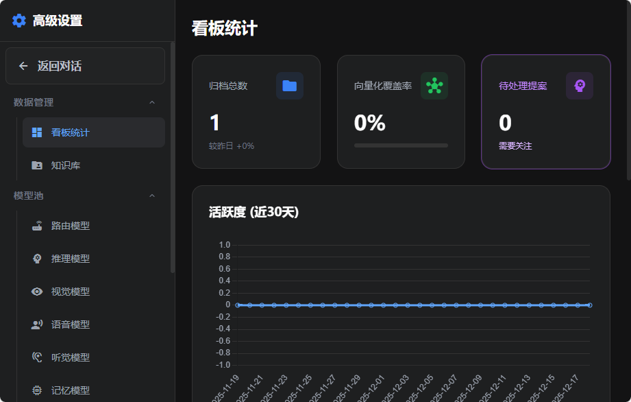

# Memex: Agentic RAG System (Second Brain)

> **"具有生长能力的第二大脑"**
> *A Self-Evolving, Neural-Cognitive Knowledge System.*
> 
>
> 🇨🇳 [中文文档](README.md) | 🇺🇸 [English README](README_EN.md)

---

## 🚀 核心特性 (Key Features)

Memex 不仅仅是一个文档检索库，它是一个**模拟人类认知过程**的分布式智能系统。它解决了传统 RAG "检索即遗忘" 和 "切片导致语义丢失" 的核心痛点。

### 1. 🧬 Parent-Child Indexing (父子索引架构)
传统的 RAG 将文档切碎后，切片便失去了上下文。Memex 采用 **双层索引双层架构**：
- **Layer 1 (Parent)**: 存储完整的原始档案，保持宏观语义。
- **Layer 2 (Child)**: 存储原子化的知识切片。
- **Context Injection**: 每一个切片在入库前，都会被注入父文档的元数据（文件名、时间、章节），确保即使是 "它花费了 50 元" 这样的孤立句子，也能被检索并理解为 "2023年财报中项目 A 花费了 50 元"。

### 2. 🌱 Gardener Agent (暗夜园丁)
知识库不是静态的垃圾堆，而是需要维护的花园。
- **自主回溯**: 这是一个后台驻留的 Agent (Running on NAS)。
- **语义重构**: 它可以扫描早期粗糙摄入的文档，利用更先进的模型（如 Gemini 1.5 Pro / Claude 3.5 Sonnet）重新进行 **语义切分 (Semantic Split)** 和 **元数据补全**。
- **持续进化**: 昨天的死数据，在今晚经过 Gardener 的耕耘后，明天将变成更鲜活的知识。

### 3. ⚗️ Nightly Distillation (夜间蒸馏)
Memex 拥有类似人类睡眠时的 **海马体回放机制**。
- **每日简报**: `ChatDistiller` 会在每天凌晨唤醒，分析 T-1 日的所有对话。
- **记忆压缩**: 将冗长的聊天记录蒸馏为精炼的 "今日知识点" 和 "待办事项"。
- **知识融合**: 这些蒸馏后的内容会被重新写入知识库，成为可被检索的长期记忆。

---

## 🏗️ 系统架构 (Architecture)

<!-- 架构图位置 -->
> [!NOTE]
> **Architecture Diagram Placeholder**
> (See `.ai/AI_MAP.md` for the single source of truth regarding system architecture)

### 核心流转 (The Neural Loop)

1.  **Node A: Neural Router (前额叶)**
    *   **意图识别**: 不再盲目搜索。Router 会先进行 "思维链" (CoT) 推理，判断用户意图是 `search` (查资料)、`chat` (闲聊) 还是 `analyze` (深度分析)。
    *   **自我反思**: 如果意图模糊，Router 会触发 `Hesitation Protocol`，主动反问用户，拒绝瞎猜。

2.  **Node B: Hippocampus (海马体)**
    *   **混合检索**: 结合 Dense Vector (语义) + Sparse Keyword (关键词) + Re-ranker (语义重排序)。
    *   **时空锚点**: 检索时强制注入 `Current Server Time`，让 AI 拥有时间观念。

3.  **Node C: Neural Refiner (认知重整)**
    *   **虚无抑制**: 如果检索结果为空，系统会自动熔断 LLM 调用，防止幻觉，并降级为 "最近文件浏览器" 模式。

---

## 🛠️ 技术栈 (Tech Stack)

*   **Backend**: Python 3.11 + FastAPI (Async High Performance)
*   **Database**: PostgreSQL 16 + `pgvector` (Vector Store)
*   **AI Engine**: Multi-Provider Support
    *   Google Gemini Pro / Flash
    *   Anthropic Claude 3.5 Sonnet
    *   Aliyun Qwen (DashScope)
*   **Vector Search**: BGE-M3 (Embedding) + BGE-Reranker-V2-M3 (Re-ranking)

---

## 💻 开发与运行环境 (Development & Environment)

### Running on NAS
本项目专为 **High-Availability NAS** 环境设计 (Synology/QNAP/Unraid)。
- **Docker-First**: 所有组件全容器化。
- **Volume Mapping**: 数据持久化映射到 NAS 物理存储。
- **Resource Optimization**: 针对 NAS CPU/RAM 进行推理优化 (ONNX Runtime)。

### 🤖 AI-Native Development (AI 原生开发声明)
本项目采用 **人机回圈 (Human-in-the-loop)** 模式构建，代码主要由 Advanced AI Agents 协作生成。
*Built with Human-in-the-loop methodology, code co-authored by Advanced AI Agents.*

| Role | Tool / Model | Status |
| :--- | :--- | :--- |
| **Integrator (集成环境)** | **Cursor (Auto Mode)** | Primary Editor |
| **Architect (架构师)** | **Antigravity Claude 3 Opus 4.5** | System Design |
| **Engineer (核心编码)** | **Antigravity Google Gemini 3.0 Pro** | Implementation |

> "Code written by AI, for AI, curated by Human."
> *"代码由 AI 编写，为 AI 而生，经由于人通过。"*


---

## 📂 项目结构 (Structure)

详见 [doc/PROJECT_STRUCTURE.md](doc/PROJECT_STRUCTURE.md) 获取完整目录树。

*   `src/services/agents/`: 智能体核心 (Router, Retrieval)
*   `src/plugins/`: 插件系统 (Gardener, Archiver)
*   `src/models/`: 双层索引模型定义
*   `.ai/`: **关键** - 项目架构图与设计文档

---

## ⚡ 快速开始 (Quick Start)

1.  **环境配置**
    ```bash
    cp .env.example .env
    # 配置 OpenAI / DashScope / Gemini API Key
    ```

2.  **启动服务 (NAS/Docker)**
    ```bash
    docker-compose -f docker-compose.nas.yml up -d --build
    ```

3.  **初始化数据库**
    ```bash
    docker exec -it memex-backend python scripts/init_database.py
    ```

---

*Memex © 2025 - Designed for the Age of AI.*